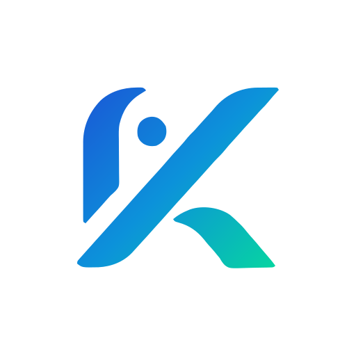

<div align="center">
  
</div>

# KCode

### Deterministic AI security scanner and coding assistant for the terminal

*by Astrolexis — Kulvex product family*

---

## The problem

Modern AI coding tools have two failure modes:

1. **Cloud-only tools** (Copilot, Cursor, Claude Code) send your source code to
   third-party servers. For regulated industries, defense contractors, and
   security-critical codebases, this is a non-starter.

2. **LLM-first SAST tools** feed the entire codebase to a large model and hope
   it notices bugs. One audit burns hundreds of thousands of tokens, costs
   real money, and still misses deterministic patterns that a grep could catch.

KCode flips the architecture: **scan deterministically, verify locally.**

---

## How it works

```
  ┌──────────────────────────────────────────────────┐
  │  256 hand-written patterns scan your source      │
  │  (C, Rust, Go, Python, TypeScript, and 20 more)  │
  └────────────────────┬─────────────────────────────┘
                       │
                       ▼
  ┌──────────────────────────────────────────────────┐
  │  Candidate findings are queued                   │
  └────────────────────┬─────────────────────────────┘
                       │
                       ▼
  ┌──────────────────────────────────────────────────┐
  │  A small local LLM (runs on your GPU)            │
  │  verifies each finding in isolation              │
  │  — its only job is to strip false positives      │
  └────────────────────┬─────────────────────────────┘
                       │
                       ▼
  ┌──────────────────────────────────────────────────┐
  │  SARIF v2.1.0 report — drop-in for GitHub        │
  │  Code Scanning, Azure DevOps, SonarQube          │
  └──────────────────────────────────────────────────┘
```

**Your source never leaves your machine.** The verifier is a local model.
The pattern scanner runs in milliseconds. A full audit of a 50k-line
codebase completes in approximately 50 seconds and costs zero cloud tokens.

---

## Validated on real code

**NASA Interior Exterior Development Framework (IDF)** — a C codebase used
in spaceflight-support tooling.

- **31 candidate findings** after deterministic scan
- **28 confirmed** after local-LLM verification (91% precision)
- **Merged into upstream NASA/IDF** as pull request #107
- Findings included pointer-arithmetic bugs, unreachable error handling,
  out-of-bounds reads in USB decoder code

Full run: **~50 seconds. Zero cloud tokens. Reproducible by anyone with
the binary.**

PR: https://github.com/nasa/IDF/pull/107

---

## Why KCode is different

|  | KCode | Semgrep | CodeQL | Snyk | Cursor |
|---|---|---|---|---|---|
| LLM-verified findings | ✓ | ✗ | ✗ | ✗ | N/A |
| Source stays local | ✓ | ✓ | ✓ | Depends | ✗ |
| Open source | Apache 2.0 | OSS core | Closed | Closed | Closed |
| Produces patches, not just flags | ✓ (`/fix`) | ✗ | ✗ | Partial | N/A |
| NASA-validated | ✓ (PR #107) | — | — | — | — |
| Terminal-native CLI | ✓ | ✓ | CLI + GUI | GUI + CLI | GUI |
| Multi-model routing per task | ✓ (Pro) | ✗ | ✗ | ✗ | Manual |

**KCode does not compete on rule count.** Semgrep has ~2000 rules; CodeQL
has deeper dataflow. KCode occupies a narrower niche: **hybrid verification
for teams that cannot ship source to the cloud**, with automated patching
and PR generation to close the loop.

---

## Quick start

```bash
# One-line install (Linux / macOS, x64 or ARM64)
curl -fsSL https://kulvex.ai/kcode/install.sh | sh

# First run — the setup wizard auto-detects your hardware
kcode

# Scan a project
/scan ./my-project
/fix  ./my-project        # generate deterministic patches
/pr   ./my-project        # open a pull request with findings + fixes
```

That's three commands from a clean checkout to a reviewed PR.

---

## Tier and pricing

### Core — free, Apache 2.0

Full CLI, pattern scanner, local LLM verifier, 46 built-in tools, SARIF
export, plugin system, hooks, MCP support, and single-model agent loop.
Use it at home, in CI/CD, in your own fork, in commercial products — no
restrictions.

### Individual Pro — $19 / month

- **Multi-Model Orchestrator** — paste a multi-intent prompt; KCode
  automatically decomposes it into sub-tasks and routes each to its best
  model (reasoning → grok-reasoning, coding → grok-code-fast, chat → local)
- **Parallel execution** of independent sub-tasks with per-file locking
- **Auto-benchmarking** of newly-registered models
- **Hallucination recovery** — models that emit malformed tool calls
  (XML, Python, JSON block) are rescued automatically
- **Custom routing rules** with ReDoS protection
- **Cloud failover chains** — automatic model switching on rate limits

### Team — $49 / user / month

Everything in Individual Pro plus:

- Hosted KCode Cloud — shared sessions and context across the team
- Team dashboard — aggregated cost and usage
- Shared benchmark and plugin repositories
- SSO (Google Workspace, Microsoft Entra, SAML)
- Team-wide audit logs and transcript search

### Enterprise — custom pricing

- **Managed audit service** — Astrolexis engineers run KCode on your
  codebase and deliver a triage report ($5k–$50k per engagement)
- Air-gapped on-premise deployment (zero telemetry)
- Compliance evidence packs (SOC 2, ISO 27001, HIPAA)
- Industry-specific pattern packs (fintech, healthcare, defense)
- Priority SLA — 4-hour response, dedicated engineer
- White-label / rebranding
- Custom integrations (JIRA, Slack, PagerDuty, SOAR)

---

## Technical highlights

- **Bun + TypeScript** — single static binary, no runtime dependencies
- **React/Ink terminal UI** — modern interactive CLI, not a REPL
- **256 patterns** covering C, Rust, Go, Python, TypeScript, JavaScript,
  Java, Kotlin, Swift, Ruby, PHP, C#, Dart, Scala, and 10 more
- **Local verifier** — runs on a 24GB GPU (RTX 4090, M2 Max) or falls
  back to cloud for weak hardware with BYO API keys
- **Multi-provider** — Anthropic, OpenAI, xAI, Kimi (Moonshot), Gemini,
  Groq, DeepSeek, Together AI
- **190+ slash commands** for git, review, test, debug, refactor, audit
- **SQLite FTS5** persistent memory across sessions
- **Plugin SDK** — directory-based plugins with skills, hooks, MCP bundles

---

## Get in touch

- **Web**: https://kulvex.ai/kcode
- **GitHub**: https://github.com/AstrolexisAI/KCode
- **Pro licensing and enterprise sales**: contact@astrolexis.space
- **Security disclosures**: see `SECURITY.md` in the repository

---

*KCode is built by Astrolexis. Copyright © 2026.*  
*Core licensed under Apache 2.0. Pro features under commercial license.*
